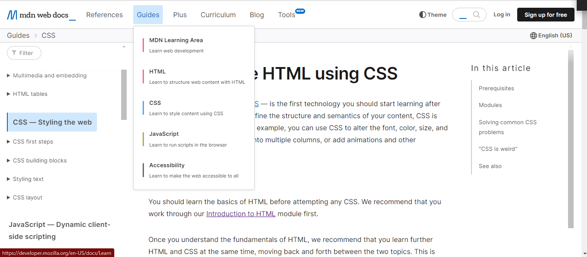
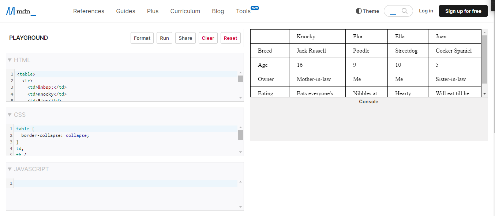

# MDN Web Docs as : Tutor, Tool, Tutee

### MDN Web Docs Description
MDN Web Docs adalah perpustakaan online yang cukup lengkap bagi untuk seorang web development. Platform ini menyediakan tutorial, referensi, dan contoh kode yang mendalam untuk berbagai teknologi web seperti HTML, CSS, dan JavaScript mulai dari konsep dasar hingga fitur-fitur terbaru. MDN Web Docs sangat membantu mulai dari pemula hingga ahli, yang ingin  membangun situs web yang inovatif

#### MDN Web Docs as Tutor
MDN Web Docs bisa berfungsi sebagai **tutor/pengajar** dalam memberikan penjelasan yang mendalam tentang konsep-konsep web development. MDN Web Docs menyajikan beberapa materi seperti berikut :

disini pengguna dapat mencoba kodenya langsung pada website dan MDN Web Docs.

#### MDN Web Docs as Tool
MDN Web Docs bisa berfungsi sebagai **alat** yaitu ada kode editor nya langsung, jadi selama pengguna bisa mempelajari kode pemrograman yang ada tanpa perlu membuka kode editor lain lagi untuk mencoba menjalankan programnya, kode program juga bisa langsung dijalankan (run) di website tersebut.

#### MDN Web Docs as Tutee
MDN Web Docs bisa berfungsi sebagai **murid**, dimana MDN Web Docs mengajak pengembang untuk belajar sambil mencoba contoh kode dan membangun proyek kecil sendiri. Jadi pengembang secara bertahap menguasai konsep-konsep web yang kompleks, menjelajahi dan bereksperimen dengan berbagai contoh kode dan tutorial di MDN, pengembang berperan aktif dalam memperdalam pemahaman mereka tentang teknologi web.
